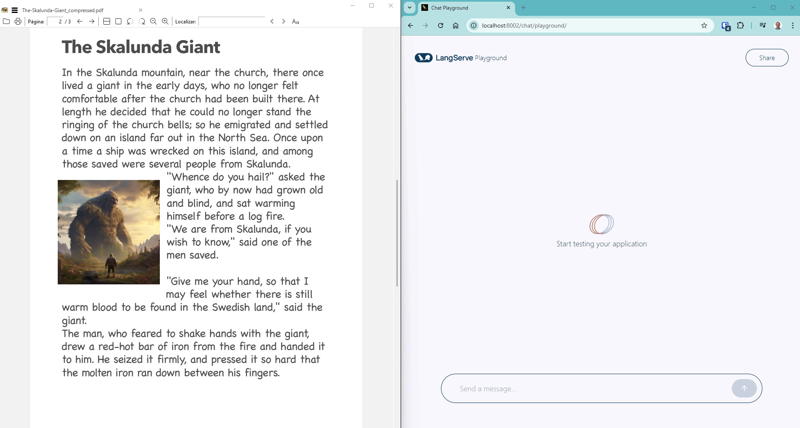

# AskMyPdf

**AskMyPdf** is an open source application that transforms PDF files into searchable sources through natural language. With support for local or remote LLMs, the system allows you to upload documents, ask questions in natural language, and receive answers based on the actual content of the PDFs — all using vector embeddings and semantic search techniques.

---

## 🚀 Features

- **Chat with your PDFs:** Ask questions and get answers based on the actual content of your documents.
- **Semantic search:** Uses embeddings and FAISS for fast and relevant search.
- **LLM integration:** Connects to local or remote LLM servers (OpenAI-compatible APIs).
- **Modern API:** Built with FastAPI and LangServe, with an interactive playground for testing.
- **Containerization:** Production-ready with Docker and Docker Compose.
- **Extensible:** Easy to adapt for new document types, LLMs, or workflows.

---

## 🏗️ Architecture Overview


---

## ⚡ Getting Started

### 1. Configure environment variables

Edit the `.env` file with your LLM endpoint and model details:

```env
LLM_LOCAL_ENDPOINT=http://host.docker.internal:1234/v1
LLM_MODEL_NAME=google/gemma-3-1b
OPENAI_API_KEY=your-key
PDF_PATH=/pdfs
```

### 2. Add your PDFs

Place your PDF files in the directory specified by `PDF_PATH` (default: `/pdfs`).

### 3. Run the application with Docker Compose

```bash
docker-compose up --build
```

---

## 🧑‍💻 How to Use

- Access the interactive playground at [http://localhost:8002/chat/playground/](http://localhost:8002/chat/playground/)
- Use the `/chat` endpoint to send questions and receive answers based on your PDFs.

## Demo:  


---

## 🛠️ Customization

- **Change the LLM:** Edit the `.env` file to point to any OpenAI-compatible endpoint.
- **Add more PDFs:** Just place the files in the `PDF_PATH` directory and restart the application.
- **Extend:** The code is modular — add new loaders, retrievers, or chains as needed.

---

## 🤝 Contributing

Pull requests and suggestions are welcome! Open an issue to discuss ideas or report bugs.

---

## 📄 License

This project is licensed under the MIT license.

---

**AskMyPdf** — Unlock the knowledge in your documents with AI.
