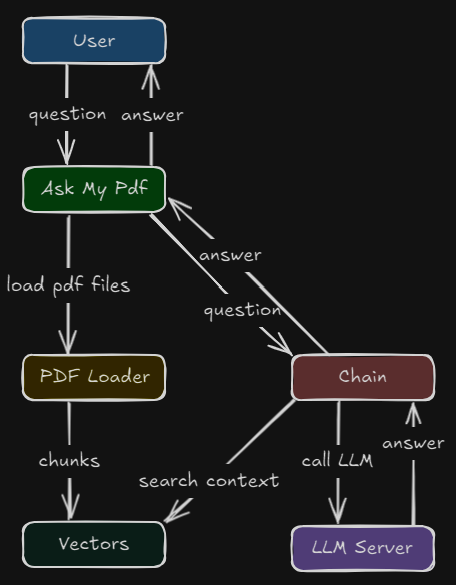
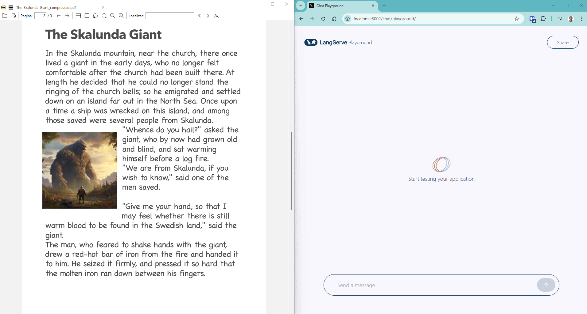

# AskMyPdf

O **AskMyPdf** é uma aplicação open source que transforma arquivos PDF em fontes consultáveis por meio de linguagem natural. Com suporte a LLMs locais ou remotos, o sistema permite fazer upload de documentos, realizar perguntas em linguagem natural e receber respostas baseadas no conteúdo real dos PDFs — tudo com uso de embeddings vetoriais e técnicas de busca semântica.

---

## 🚀 Funcionalidades

- **Converse com seus PDFs:** Faça perguntas e obtenha respostas baseadas no conteúdo real dos documentos.
- **Busca semântica:** Utiliza embeddings e FAISS para busca rápida e relevante.
- **Integração com LLMs:** Conecta-se a servidores LLM locais ou remotos (APIs compatíveis com OpenAI).
- **API moderna:** Construída com FastAPI e LangServe, com playground interativo para testes.
- **Containerização:** Pronto para produção com Docker e Docker Compose.
- **Extensível:** Fácil de adaptar para novos tipos de documentos, LLMs ou fluxos de trabalho.

---

## 🏗️ Visão Geral da Arquitetura



---

## ⚡ Como começar

### 1. Configure as variáveis de ambiente

Edite o arquivo `.env` com o endpoint do seu LLM e detalhes do modelo:

```env
LLM_LOCAL_ENDPOINT=http://host.docker.internal:1234/v1
LLM_MODEL_NAME=google/gemma-3-1b
OPENAI_API_KEY=sua-chave
PDF_PATH=/pdfs
```

### 2. Adicione seus PDFs

Coloque seus arquivos PDF no diretório especificado em `PDF_PATH` (padrão: `/pdfs`).

### 3. Execute a aplicação com Docker Compose

```bash
docker-compose up --build
```

---

## 🧑‍💻 Como usar

- Acesse o playground interativo em [http://localhost:8002/chat/playground/](http://localhost:8002/chat/playground/)
- Use o endpoint `/chat` para enviar perguntas e receber respostas baseadas nos seus PDFs.

## Demonstração:  


---

## 🛠️ Personalização

- **Trocar o LLM:** Edite o arquivo `.env` para apontar para qualquer endpoint compatível com OpenAI.
- **Adicionar mais PDFs:** Basta colocar os arquivos no diretório `PDF_PATH` e reiniciar a aplicação.
- **Estender:** O código é modular — adicione novos loaders, retrievers ou chains conforme necessário.

---

## 🤝 Contribuindo

Pull requests e sugestões são bem-vindos! Abra uma issue para discutir ideias ou relatar bugs.

---

## 📄 Licença

Este projeto está licenciado sob a licença MIT.

---

## 📫 Contato

- [Seu LinkedIn](https://www.linkedin.com/in/seuperfil)
- [Seu Email](mailto:seu@email.com)

---

**AskMyPdf** — Desbloqueie o conhecimento dos seus documentos com IA.

